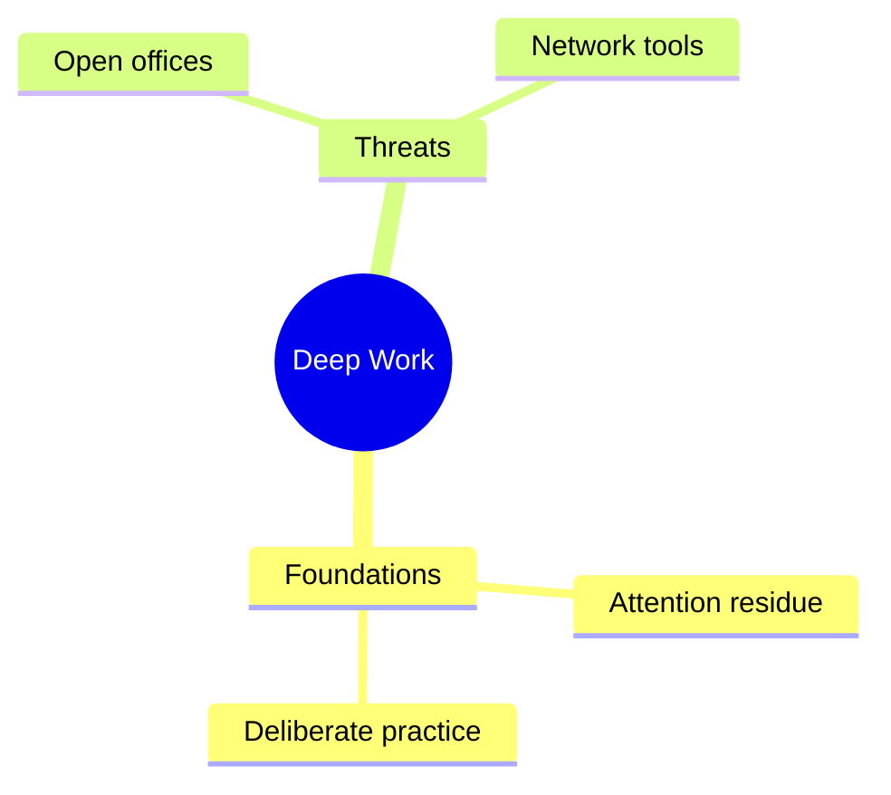

# The Studio — artifact templates and quality bars

Every artifact is a *transformation of the sources*, never new content wearing
a costume. All of them: obey the Grounding Contract, end with a Sources
footer, are saved to `.notebook/studio/<type>-YYYY-MM-DD[-topic].md` (plus
sibling files like `.csv`/`.pptx`/`.html` where noted), and honor user
customization — scope ("only the two economics papers"), audience ("for
newcomers"), length, tone, language. Before generating, confirm scope: default
is all indexed sources; a user-scoped subset changes both retrieval and the
footer.

A note on effort: NotebookLM artifacts feel effortless to the user but are
built on full-corpus awareness. For multi-source notebooks, do the
source-by-source pass (see ingestion.md, "Big corpora") before writing any
whole-notebook artifact.

---

## Briefing doc

The "read this and you're caught up" document. Structure:

```markdown
# Briefing Doc: <notebook or scoped topic>

## Executive summary
3–6 sentences: what these sources are and the single most important throughline.

## Key themes and ideas
3–6 themes. Each: a bolded claim-style heading, a paragraph synthesizing what
the sources say (citations), including where sources reinforce or contradict
each other.

## Notable facts & figures
5–10 of the most decision-relevant or surprising specifics — numbers, dates,
definitions — each cited. Prefer a compact list here; this section is a lookup
table.

## Conclusions / implications
What the sources themselves conclude (cited), kept separate from labeled
inference if you add any.

Sources
[...]
```

Quality bar: an executive who reads only this makes no claim a source-reader
would correct.

## Study guide

NotebookLM's classic study guide has three parts — keep all three:

```markdown
# Study Guide: <topic>

## Quiz — short answer (10 questions)
Q1–Q10, each answerable in 2–3 sentences from the sources. Cover the full
scope, not just the opening chapters; mix recall ("What is X?") with
understanding ("Why does the author reject Y?").

## Quiz — answer key
The 2–3 sentence answers, each cited.

## Essay questions (5)
Prompts only, no answers. Each should force synthesis across sections or
sources ("Compare how S1 and S3 explain...").

## Glossary of key terms
15–25 terms with one-sentence, source-faithful definitions (cited). Use the
sources' own definitions, not textbook-generic ones.

Sources
[...]
```

## FAQ

6–10 questions a genuinely curious reader of these sources would ask —
including at least one skeptical question ("Doesn't this contradict...?") and
one practical one ("How would I apply...?"). Answers are 2–5 sentences,
cited. Order from foundational to advanced. Never invent a question the
sources can't answer; that's the FAQ version of hallucination.

## Timeline

Two sections, always both — the second is NotebookLM's signature move:

```markdown
# Timeline: <topic>

## Chronology of events
Chronological list. Each entry: **date/period — event** + 1–2 sentence
description (cited). Use the sources' precision: if a source says "the late
1970s", don't sharpen it to "1978". Undatable-but-ordered events go in
sequence with "(undated; after X)".

## Cast of characters
Every person (or organization/entity, for non-human histories) appearing
above: **Name** — 1–3 sentence bio strictly limited to what the sources say
about them (cited).

Sources
[...]
```

## Mind map

A tree from one central node: central topic → 4–8 main themes → 2–6 subtopics
each → (optional) leaf details. Node labels are 1–5 words; the map shows the
*shape* of the material, not its prose. Derive branches from actual coverage —
a theme one source mentions once is a leaf, not a branch.

Deliver two synchronized renderings in one file:

1. An indented Markdown outline (works everywhere, easy to expand later).
2. A Mermaid `mindmap` block (renders in most Markdown viewers):



Mimic NotebookLM's interactivity conversationally: "say 'expand <branch>' to
go deeper, or ask about any node" — expanding a branch means a focused,
grounded mini-answer or a regenerated subtree with more depth. Keep a
citation appendix mapping each main branch to its supporting sources (leaf
nodes don't need individual citations; branches do).

## Flashcards

~20 cards (or as requested) in two Markdown columns `Front | Back`, fronts as
prompts (term, question, fill-in-the-blank), backs 1–2 sentences,
source-faithful. Mix levels: definitions, why-questions, applications,
contrasts. Offer a `flashcards.csv` (two columns, no header) for Anki import.
Citations go in a compact appendix (card # → source), not on the cards —
cards must stay clean for studying.

## Quiz

8–12 multiple-choice questions, 4 options each, exactly one correct.
Distractors must be *plausible* — ideally misconceptions the sources
themselves warn about. Answer key in a separate section: correct letter + 1–2
sentence explanation + citation per question. Include difficulty spread and
say so ("Q1–4 recall, Q5–9 application, Q10–12 synthesis"). If the user wants
to *take* the quiz interactively, present questions one at a time, grade with
explanations, and keep score.

## Data table

For "pull the scattered X into one comparable view" requests (feature
comparisons, study parameters across papers, character attributes, financials
across reports). Choose rows = entities, columns = attributes the sources
actually provide. Empty cell = "—" (absence is information; never fill by
inference). Emit the Markdown table plus a `.csv` sibling. Cite per row or per
cell-cluster in an appendix keyed to the table ("Row 'Provider B': [3][4]").
If a column would be >80% empty, drop it and say why.

## Comparison / position map

For "what do the authors disagree about", "map each source's stance on X",
and competitor/feature comparisons. This is the artifact most punished by
shallow retrieval, so it has its own discipline:

- **Work the grid.** The unit of retrieval is the (source × topic) cell: run a
  scoped synonym sweep for every cell —
  `search_index.py <folder> "loudness war" "volume war" "hypercompression" --sources S5` —
  not a handful of whole-notebook queries. A cell earns *Not covered* only
  after its sweep comes back empty (grounding.md, "Absence is a claim").
- **Unpack anthologies.** Interview/quote-built sources contain many
  positions; attribute each to the quoted voice and surface disagreements
  *within* a source as first-class findings (grounding.md, "Who said it").
- **A contradiction is incompatible answers to the same question.** "A uses
  multiband processing in mastering" vs "B says leave multiband to mastering"
  is agreement wearing different hats; forcing it into the contradictions
  list is a synthesis error. For each flagged contradiction, state the shared
  question, then each side with its citation. Differences of scope, era, or
  emphasis go in prose as "differences", not "contradictions".
- **Carry the numbers.** Positions stated with settings/figures keep them,
  verbatim ranges included; a position summarized without its numbers is
  half-reported.
- Close with the per-source × per-topic table (citations in cells, *Not
  covered* where earned), and note conflicting facts you could not reconcile
  ("S4 quotes the same engineer at both 40 and 85 dB SPL [n][m]").

## Report (custom formats)

NotebookLM lets users name arbitrary formats — blog post, glossary, book
review, executive memo, lesson plan, meeting brief, literature review. Accept
any of them. The invariants: structure appropriate to the named genre,
grounding rules unchanged, Sources footer present. For public-facing genres
(blog post), citations may read awkwardly inline — keep the inline markers
light (cite the load-bearing facts, not every sentence) and put the full
footer at the end; tell the user they can strip it for publication.

Also mirror NotebookLM's *suggested* reports: after Phase 2, if the notebook
has an obvious shape (a contract → "clause-by-clause plain-English summary"; a
codebase → "architecture overview"), you may offer one tailored format by
name alongside the standard catalog.

## Tutorial / how-to guide

For "teach me to do X" and "give me a workflow for Y" requests. A tutorial is
judged by whether the reader can *execute* it, so it earns first-class rules
beyond the generic report:

- **Harvest parameters before writing.** Sweep the scoped sources and collect
  every concrete setting they offer on the topic — frequencies, dB amounts,
  ms values, ratios, thresholds, temperatures, dimensions, model numbers.
  Specificity is what separates a tutorial from a summary; a vague step the
  sources made precise is a fidelity failure. (Keep the sources' hedges and
  ranges: "20–50 ms" stays a range.)
- **Order sections by workflow**, not by source: the sequence a practitioner
  would actually follow (plan → build → refine → finish).
- **Numbered procedures.** Any technique with 3+ steps becomes an explicit
  numbered list (1. Route... 2. Insert... 3. Blend...), one action per step,
  cited. Prose descriptions of multi-step processes are where readers get
  lost.
- **Micro-labels.** Inside sections, bold 2–4-word labels for each distinct
  move (*Creating a hole:*, *Pre-delay gap:*, *Workflow tip:*) so the piece
  skims well.
- **Name the named things.** If the sources name a technique ("New York
  compression", "the Abbey Road curve"), keep the name — names are retrieval
  hooks for the reader.
- **Close with a quick-reference table** whenever the tutorial accumulated
  tabular parameters (instrument × frequency × action, ingredient × amount,
  setting × value): a consolidated, cited summary table the reader can work
  from without rereading the prose. This closing table is a NotebookLM
  signature and users specifically miss it when absent.
- **Cite convergent support.** When several passages independently back one
  instruction, cluster the markers (`[3][7]`) — breadth of support is itself
  information in a how-to.
- Everything else per the contract: no step the sources don't support; gaps
  named ("the sources don't cover gain-staging for live use").

## Slide deck

If a pptx-creation capability exists in the environment (e.g. a pptx skill),
use it and follow its guidance. Otherwise emit `slides.md`: one `## Slide N:
Title` per slide with 3–5 bullet lines and a `Speaker notes:` paragraph.
Structure: title slide → agenda → one idea per slide (8–15 slides) → key
takeaways → sources slide. Slide text is telegraphic; the speaker notes carry
the cited detail.

## Infographic

A single-page visual summary. With HTML capability: one self-contained
`infographic.html` (inline CSS, no external assets) — a headline, 3–5 stat or
concept blocks, a flow or comparison visual built from HTML/CSS, and a sources
line in the footer. Without: a precise textual spec (layout, blocks, copy for
each block, all numbers cited) the user can hand to a designer. Every number
on the infographic must appear in the sources — decorative precision is
forbidden.
